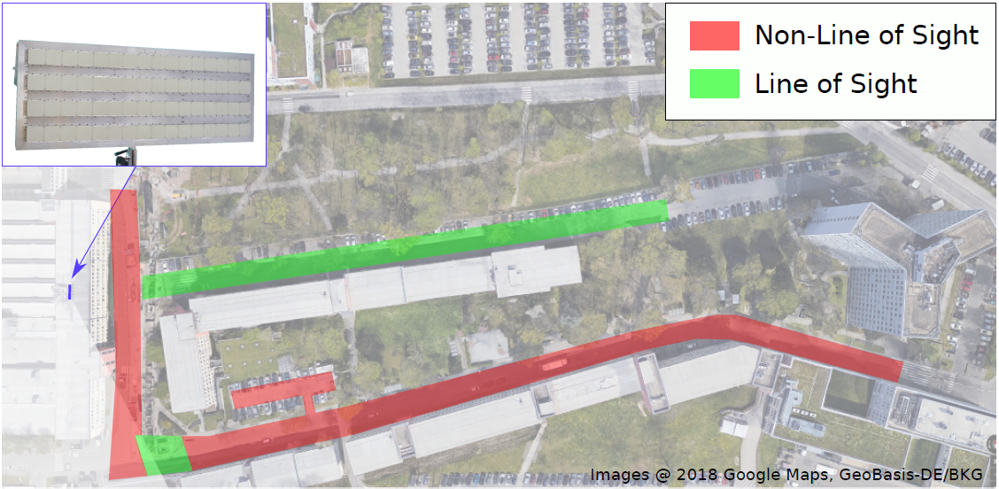
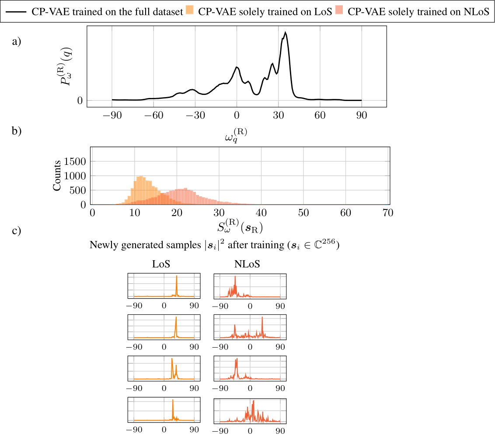

# Rebuttal

## Figure 1. Additional Baselines for Parameter Generation (AmbientGAN for s, and M-SBL)

a) Eight exemplary training samples, b) power angular profile and a histogram of the angular spread from 10000 generated samples by CP-VAE, CP-GMM, AmbientGAN with a generator outputting s and M-SBL, compared to ground truth, c)squared absolute value of four exemplary generated samples of CP-VAE, CP-GMM, AmbientGAN with a generator outputting s and M-SBL, respectively.

## Figure 2. Experiments regarding the number K of CP-GMM components

Dependency of the angular spread on the number K of components of the CP-GMM.

## Figure 3. Experiments regarding the Grid Resolution in OFDM simulations

a) and b) nMSE and cosine similarity for reconstructing ground-truth channels by an autoencoder trained on channel realizations produced by the generative models, respectively. We choose the maximally resolvable delay to be 8μs and the maximally resolvable doppler shift to be 100Hz, but vary the grid resolution S, i.e., the delay-doppler grid exhibits S^2 gridpoints. In c), exemplary drawn samples are shown for the different grid resolutions.

## Figure 4. Bird Perspective of the NokiaCampus used for the measurement Campaign and marked LoS and NLoS regions

## Figure 5. Experiments regarding the Measurement Campaign Data

a) Power angular profile of newly generated samples by the CP-VAE when it is trained on the full dataset from the measurement
campaign. b) Histogram of the angular spread when the CP-VAE is solely trained on LoS channels in the measurement campaign, and
solely trained on NLoS channels in the measurement campaign. c) Exemplary samples drawn from the CP-VAEs trained on solely LoS
and NLoS channels.

