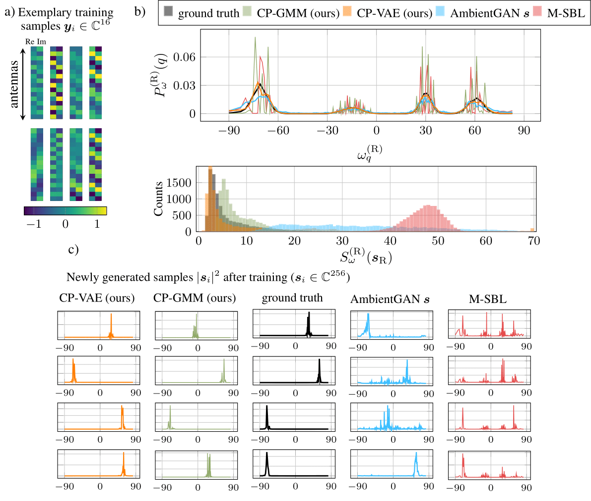
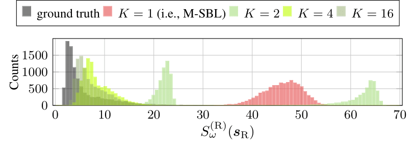
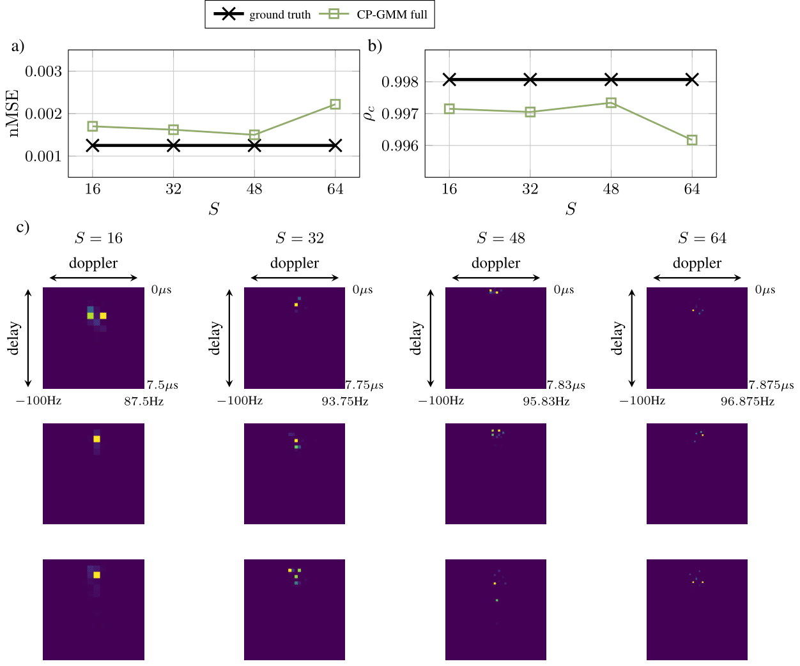

# Rebuttal

## Figure 1. Additional Baselines for Parameter Generation (AmbientGAN for s, and M-SBL)

a) Eight exemplary training samples, b) power angular profile and a histogram of the angular spread from 10000 generated samples by CP-VAE, CP-GMM, AmbientGAN with a generator outputting s and M-SBL, compared to ground truth, c)squared absolute value of four exemplary generated samples of CP-VAE, CP-GMM, AmbientGAN with a generator outputting s and M-SBL, respectively.

## Figure 2. Experiments regarding number K of CP-GMM components

Dependency of the angular spread on the number K of components of the CP-GMM.

## Figure 3. Experiments the Grid Resolution in OFDM simulations

a) and b) nMSE and cosine similarity for reconstructing ground-truth channels by an autoencoder trained on channel realizations produced by the generative models, respectively. We choose the maximally resolvable delay to be 8μs and the maximally resolvable doppler shift to be 100Hz, but vary the grid resolution S, i.e., the delay-doppler grid exhibits S^2 gridpoints. In c), exemplary drawn samples are shown for the different grid resolutions.

